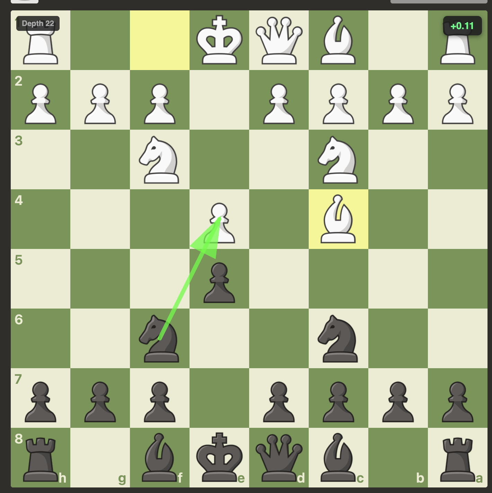

# Chess.com Best Move

Chrome extension that runs Stockfish 18 directly in the browser on live Chess.com boards. When you open a Chess.com game, the extension reads the current position, asks the bundled Stockfish WebAssembly engine for analysis, and draws best-move arrows plus optional evaluation details over the board.



## Important Warning

This extension is very likely to violate Chess.com's fair-play rules if used while playing live games. Using engine assistance during games can get your Chess.com account restricted, suspended, or permanently banned.

Use this project for educational purposes only, such as learning how browser extensions work, studying chess engine integration, reviewing your own positions outside competitive play, or experimenting in a local development environment. Do not use it to cheat against other players.

## What It Does

- Runs Stockfish 18 in a Web Worker from the bundled `stockfish/` files.
- Detects Chess.com live boards on `https://www.chess.com/*` and `https://chess.com/*`.
- Extracts the current board position as FEN.
- Sends the position to Stockfish through the UCI protocol.
- Draws the best move as an overlay arrow on the Chess.com board.
- Can show multiple principal variations, evaluation, depth, and configurable think time through the popup.

## Install From This Repo

No build step is required. Chrome can load this folder directly as an unpacked extension.

1. Clone or download this repository.

   ```sh
   git clone <repo-url>
   cd chess_chrome
   ```

2. Open Chrome.

3. Go to:

   ```text
   chrome://extensions/
   ```

4. Turn on Developer mode using the toggle in the top-right corner.

5. Click Load unpacked.

6. Select this repository folder:

   ```text
   /Users/mate/work/chess_chrome
   ```

   If you cloned the repo somewhere else, select that `chess_chrome` folder instead. The selected folder must contain `manifest.json` at its top level.

7. Confirm that Chrome shows an extension named Chess.com Best Move.

8. Open or refresh a Chess.com game page:

   ```text
   https://www.chess.com/
   ```

9. Use the extension icon in the Chrome toolbar to enable or disable analysis and adjust settings.

## Updating After Code Changes

Chrome does not automatically reload unpacked extensions after local file edits.

1. Go to `chrome://extensions/`.
2. Find Chess.com Best Move.
3. Click the reload button on the extension card.
4. Refresh the Chess.com tab.

## Project Structure

```text
.
├── manifest.json
├── content.js
├── page-bridge.js
├── styles.css
├── chesscomexample.png
├── popup/
│   ├── popup.html
│   ├── popup.css
│   └── popup.js
├── stockfish/
│   ├── stockfish-18-lite-single.js
│   └── stockfish-18-lite-single.wasm
└── icons/
    ├── icon16.png
    ├── icon48.png
    └── icon128.png
```

## Component Overview

| Path | Purpose |
| --- | --- |
| `manifest.json` | Chrome Manifest V3 configuration, permissions, content-script registration, popup registration, icons, and web-accessible resources. |
| `content.js` | Main extension runtime on Chess.com pages. It detects boards, tracks positions, runs Stockfish, and renders board overlays. |
| `page-bridge.js` | Injected into the page context so the extension can read Chess.com page-level board APIs that isolated content scripts cannot access directly. |
| `styles.css` | Styles for the evaluation panel, depth display, and board overlay UI. |
| `chesscomexample.png` | README screenshot showing the extension overlay on a Chess.com board. |
| `popup/popup.html` | Popup markup shown when clicking the extension icon. |
| `popup/popup.css` | Popup styling. |
| `popup/popup.js` | Popup behavior and persisted settings through `chrome.storage.sync`. |
| `stockfish/stockfish-18-lite-single.js` | Stockfish JavaScript wrapper. |
| `stockfish/stockfish-18-lite-single.wasm` | Stockfish WebAssembly engine binary. |
| `icons/` | Chrome extension icons. |

## Quick Checks

This project currently has no package manager, build pipeline, or automated test command. Useful manual checks:

```sh
# Verify the extension manifest is valid JSON.
python3 -m json.tool manifest.json > /dev/null

# List tracked project files.
find . -maxdepth 3 -type f | sort
```

Then load the extension in Chrome and check the browser console on Chess.com for messages prefixed with:

```text
[Chess.com Best Move]
```

## Settings

The popup stores settings with `chrome.storage.sync`.

- `enabled`: master on/off switch.
- `moveTimeMs`: Stockfish thinking time per position.
- `multiPv`: number of engine lines to draw.
- `showEval`: show or hide the evaluation panel.
- `showDepth`: show or hide the search-depth display.

## Notes

- This extension targets Chromium-based browsers with Manifest V3 and WebAssembly support.
- The bundled engine is the single-threaded Stockfish 18 lite WebAssembly build.
- Chess.com can change its board DOM or internal APIs at any time, which may require updates to board detection or FEN extraction.
- Stockfish is licensed under GPLv3. Keep its license requirements in mind if redistributing this project.
